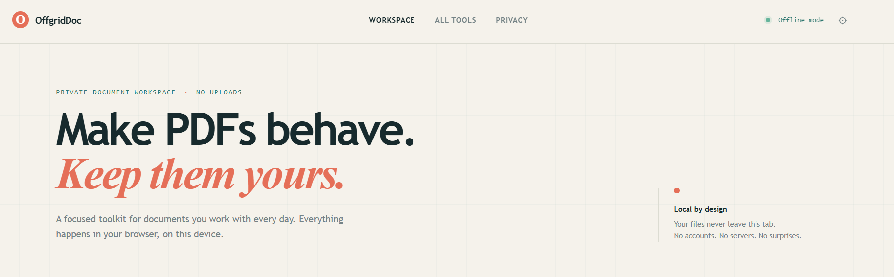
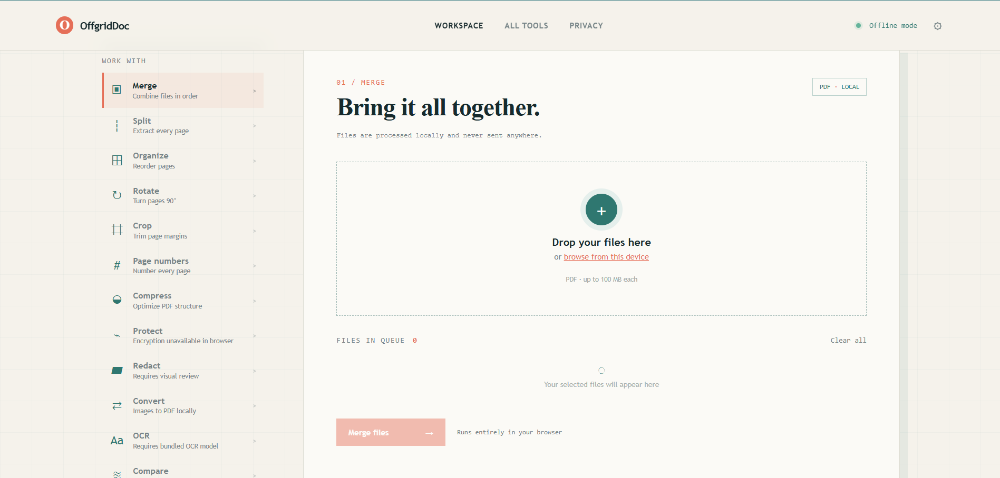

# OffgridDoc

OffgridDoc is an offline-first PDF workspace for Windows. Documents are processed in the local browser runtime and are not sent to a web service.

## Screenshots





## Download for Windows

Open the repository's **Releases** page and download the latest `OffgridDoc-Setup-*.exe`. Run the installer, then launch OffgridDoc from the Start menu or desktop shortcut.

The installer is produced by GitHub Actions when a version tag such as `v1.0.0` is pushed.

## Build locally

Requires Node.js 22 or newer.

```powershell
npm ci
npm run dist
```

The Windows installer is written to `artifacts/`.

For browser development:

```powershell
npm run dev
```

## Checks

```powershell
npm run lint
npm test
npm run build
```

`npm run lint` runs ESLint over the source, Electron main, and tests. `npm test` runs the Vitest suite (see below). CI runs all three on every push with the `.github/workflows/ci.yml` workflow.

## Evaluation method

The app is evaluated on two guarantees, and each is enforced by automated tests in `tests/`:

1. **Every tool is functionally correct.** `tests/pdf.test.js` feeds real in-memory PDFs (built with pdf-lib) through the pure logic in `src/pdf.js` and asserts the output: page counts, merge/split/order results, rotation angles, crop boxes, page-number text (recovered from the compressed content streams), and image embedding. The DOM glue in `src/main.js` is kept thin so all document logic stays unit-testable.

2. **Nothing leaves the device.** `tests/offline.test.js` statically scans every shipped source file for network APIs (`fetch`, `XMLHttpRequest`, `WebSocket`, `EventSource`, `sendBeacon`, geolocation, `http(s)://`, `ws(s)://`), and asserts the CSP sets `connect-src 'none'` in both `index.html` and the Electron handler, that the Electron shell blocks navigation/permission/net requests, and that the renderer runs sandboxed with `contextIsolation` and `nodeIntegration: false`.

Finally, before a release the built installer is smoke-tested by hand on a clean Windows machine with the network disabled: run each tool on real files and confirm the offline strip's claims.

## Offline security

- The renderer runs with `nodeIntegration: false`, `contextIsolation`, and Chromium sandboxing enabled.
- New windows, navigation, webviews, permission requests, and network requests are blocked by the Electron shell.
- The app's Content Security Policy sets `connect-src 'none'` and permits only local resources.
- No analytics, telemetry, remote fonts, upload endpoint, or account system is included.
- Working files remain in memory until the app is closed or the queue is cleared.

## Current local operations

PDF merge, split, reorder, rotate, crop, page numbering, structural compression, and JPG/PNG-to-PDF conversion are supported in the browser runtime.

## Shown but not implemented

The following tools appear in the interface but are disabled with an "unavailable" notice until the required bundled engine ships. Nothing is sent online:

- **Protect** (encryption), **Redact**, **OCR**, **Compare** — shown in the tool rail, described as unavailable.

Office conversion, signatures, AI summarization, and translation are not shown in the interface at all for the same reason.

## Release checklist

1. Update `version` in `package.json`.
2. Commit and push the change.
3. Create and push a tag: `git tag v1.0.0; git push origin v1.0.0`.
4. Download the generated installer from the GitHub Release and test it on a clean Windows machine.
